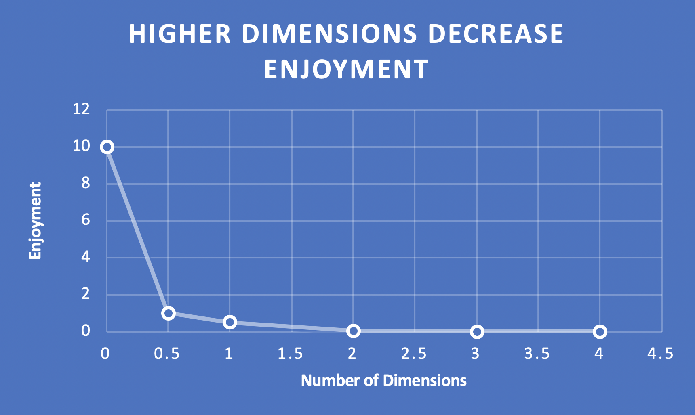

# NULL
## Premise
Tired of scrambling through a game and arriving at a junction with no idea where to go?  You just bested a hoard of monsters and completed two (2) impressive strafe jumps to arrive at what appeared to be the next location - however, there's nowhere further for you to go.  

For far too long, the gaming meta has converged upon arbitrarily rewarding a certain type of game for its non-linearity.  Not openworld games, by the way, merely the facade of an on-rails shooter giving you the "choice" between:
 - shoot em up and go left
 - go right and then shoot em up

 And inevitably the player arrives at the next point... Or at least they ought to if developers weren't so caught up in shrowding the absence of freedom from the player by way of constructing overly-complex level design.  

 This issue can and ought to be remedied which is what NULL sets out to do.  Not only have we principled ourselves for straightforward level design, but we've stripped away all unnecessary bells and whistles that ultimately serve to deceive the player. Our honest relationship with our playerbase is important to us.  

## Gameplay

In NULL, the player resides at the zero vector on the coordinate plane.  Already, we have breached the implicit trust of the player by introducing a plane into the context of gameplay.  This is because the 2 dimensional representation of Nullity is familiar to the player; do not fret, gameplay truly takes place in 0 dimensions.

The player's goal is to maximize points.  The player can earn point multipliers by clicking with the LMB.  Additionally, the player will have opportunities to interact with the environment to earn multipliers and achievements as well.

Very obviously, fewer dimensions are optimal.  

## Features
- Straight forward level design
- Accessible controls
- Scalable design (0x0 = 0)
- clicks increase multiplier
- 1 click = 0 points
- unplugging peripherals icreases multiplier

## Todo
- [ ] DLC - NULL: Origins
- [ ] Optimal system settings
- [ ] Implement achievement system
- [ ] Develop robust graphics assets
    - [ ] 3D model of level_1_boss.obj
    - [ ] Sprite sheet for the player (see mockup)
- [ ] Unlock player
- [ ] Unlock multiplier
- [ ] Unlock cursor
- [ ] Detect hardware
- [ ] Write lore
    - [ ] AvoidTheFifth
    - [ ] Time Cube
    - [ ] Higher dimensions = bad
    - [ ] Arithmoquine
- [ ] 
